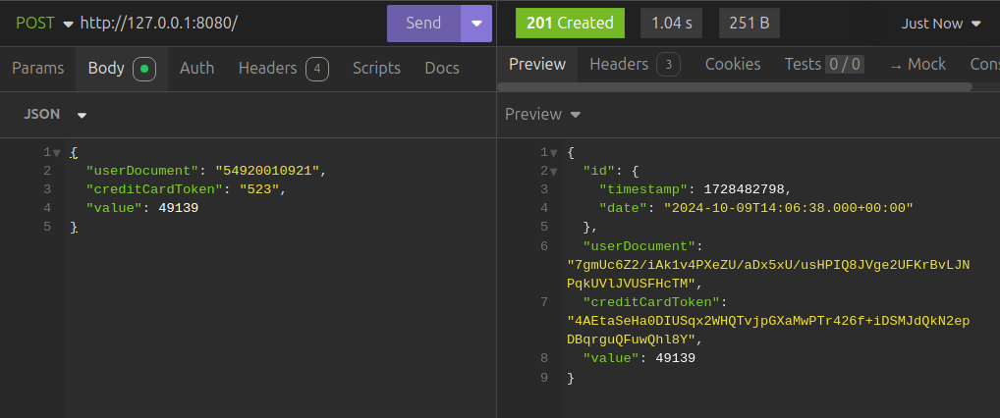

# Desafio criptografia

Este desafio compreende as técnicas de criptografia e proteção de dados sensiveis do usuário.
As tecnologias utilizadas foram Java com spring com o banco NoSql MongoDB 

## Sobre

Neste desafio foi utilizado o padrão MVC para a criação do CRUD, com o banco de dados MongoDB com uma instância criada
no docker. Assim que os dados são inseridos são criptografados dentro do banco de dados e ao serem consultados descriptografados.

### Método POST

### Método GET

### Método PUT

### Método DELETE

